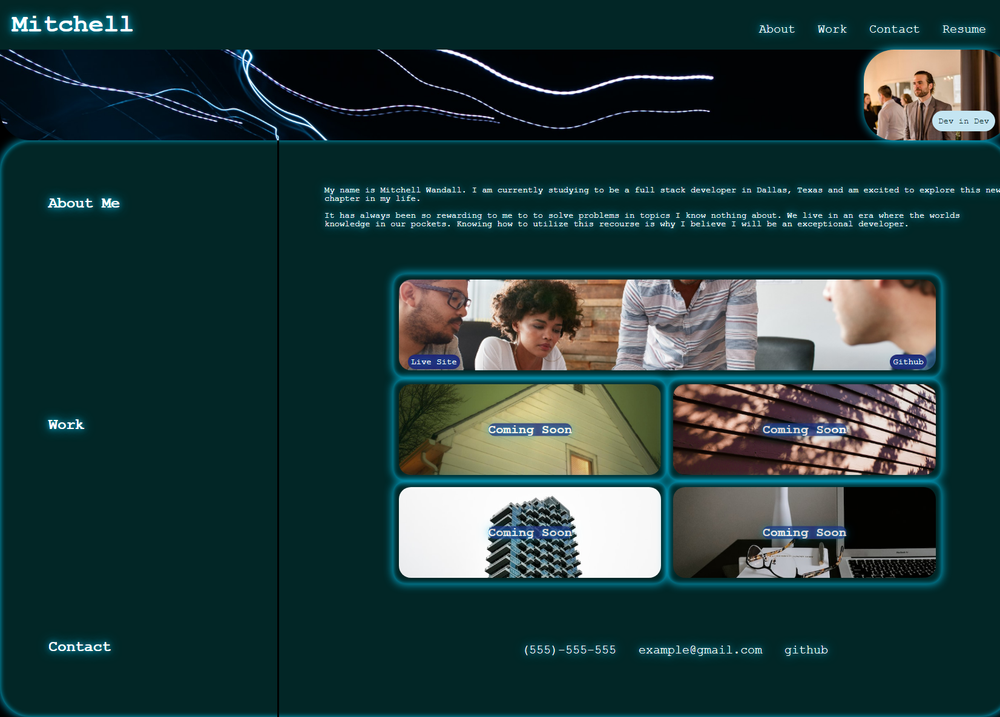

# Mitchell Wandall Portfolio

## Description

<!-- Provide a short description explaining the what, why, and how of your project. Use the following questions as a guide: -->

<!-- - What was your motivation? -->
- I wanted to create an online portfolio to show potential employers in the future. 
<!-- - Why did you build this project? (Note: the answer is not "Because it was a homework assignment.") -->
- I built this project to have a consolidated way to show my progress over the course of this class.
<!-- - What problem does it solve? -->
- This project has created a unique way to deliver my resume while adding examples of what I am capable of as a developer.
<!-- - What did you learn? -->
- While working on this project I learned how to better work with flex box and ways to make my websites more dynamic for different screen sizes.

## Table of Contents (Optional)

<!-- If your README is long, add a table of contents to make it easy for users to find what they need. -->

- [Usage](#usage)
- [Credits](#credits)
- [License](#license)

## Usage

<!-- Provide instructions and examples for use. Include screenshots as needed. -->

<!-- To add a screenshot, create an `assets/images` folder in your repository and upload your screenshot to it. Then, using the relative filepath, add it to your README using the following syntax: -->

https://mwandall.github.io/portfolio/

 

## Credits
- Image Creddits: Vitalii, Mazur, Viviana, Rishe
- README template : https://coding-boot-camp.github.io/full-stack/github/professional-readme-guide 
<!-- List your collaborators, if any, with links to their GitHub profiles.

If you used any third-party assets that require attribution, list the creators with links to their primary web presence in this section.

If you followed tutorials, include links to those here as well. -->

## License

MIT License

Copyright (c) [2023] [Mitchell Wandall]

Permission is hereby granted, free of charge, to any person obtaining a copy
of this software and associated documentation files (the "Software"), to deal
in the Software without restriction, including without limitation the rights
to use, copy, modify, merge, publish, distribute, sublicense, and/or sell
copies of the Software, and to permit persons to whom the Software is
furnished to do so, subject to the following conditions:

The above copyright notice and this permission notice shall be included in all
copies or substantial portions of the Software.

THE SOFTWARE IS PROVIDED "AS IS", WITHOUT WARRANTY OF ANY KIND, EXPRESS OR
IMPLIED, INCLUDING BUT NOT LIMITED TO THE WARRANTIES OF MERCHANTABILITY,
FITNESS FOR A PARTICULAR PURPOSE AND NONINFRINGEMENT. IN NO EVENT SHALL THE
AUTHORS OR COPYRIGHT HOLDERS BE LIABLE FOR ANY CLAIM, DAMAGES OR OTHER
LIABILITY, WHETHER IN AN ACTION OF CONTRACT, TORT OR OTHERWISE, ARISING FROM,
OUT OF OR IN CONNECTION WITH THE SOFTWARE OR THE USE OR OTHER DEALINGS IN THE
SOFTWARE.

## Features

This project features clickable links, hover effects, split images with each side linking to a different href, and hide show/functions.

